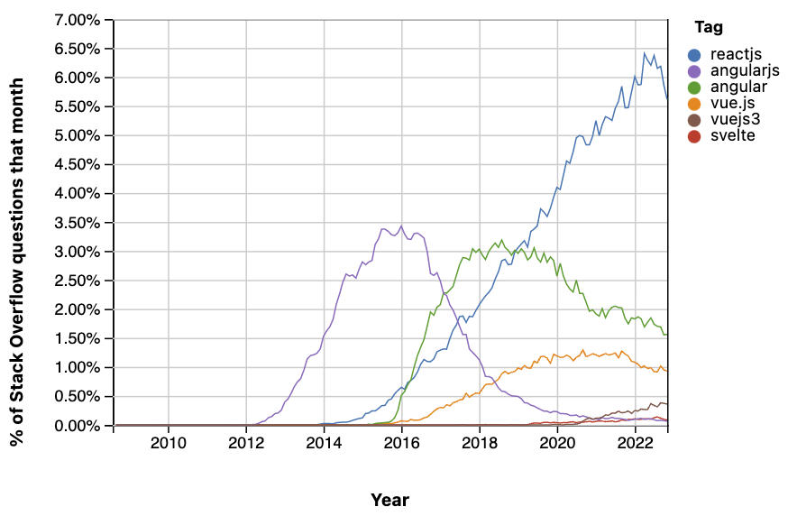
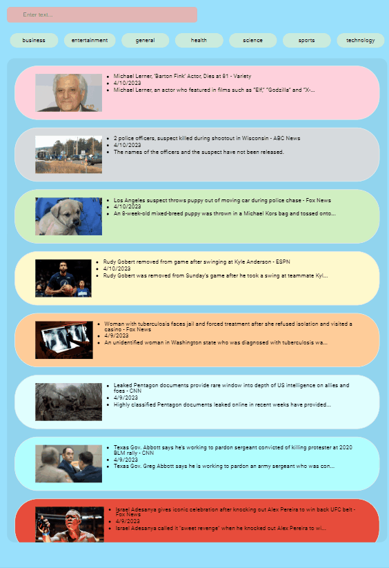
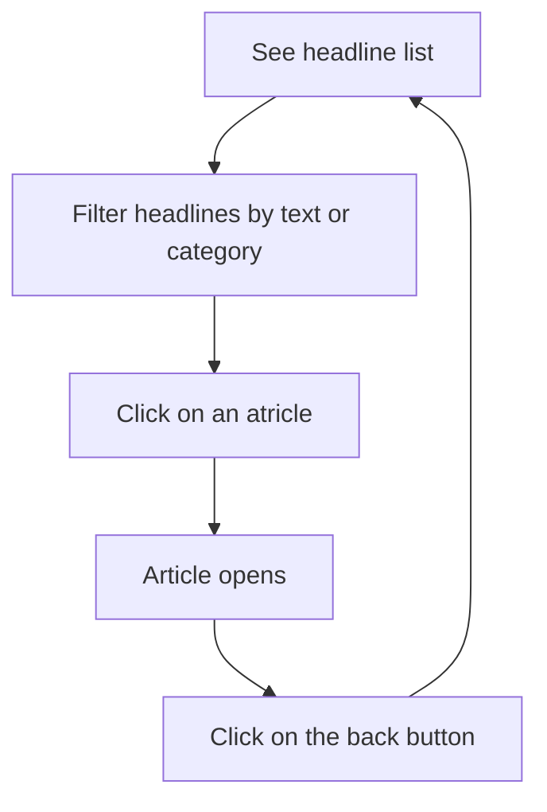
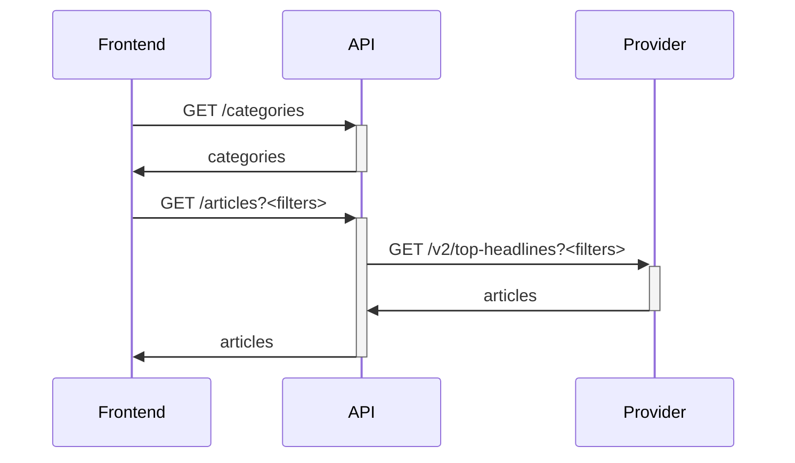

# Angular & Express news app code review

## Background

Up until 3 years ago, I used to start every front end project with Angular.
Not that is was my tool of choice, it was just the first javascript framework I learned when it was popular enough so it became my comfort zone.

But with time, other frameworks were not only closing the gap but became more popular.


Source: insights.stackoverflow.com

## Application

Then I got into a ReactJS project, and then into a VueJS project, and then React again and so on.
To stay in shape with Angular I created a small web application for displaying the latest world news per category.





The application contains two docker containers to be run with `docker compose` command: frontend and api.
The technical flow is simple: The frontend calls the api directly (or synchronously) and similarly the api in turn calls an external service provider (https://newsapi.org/ in this case).



The frontend is a single page application written in Typescript at version 4.9 under the framework of Angular at version 15.2.
The backend is a web server, with a few RESTful API endpoints, written in Javascript (ES2015 and beyond), under Node.js runtime at version 16.13, and the framework of Express.js at version 4.18.

## Code

### Backend

Starting with the Express.js backend, we have 3 endpoints, each is in a dedicated controller. One general endpoint for health checks, and other two business endpoints: for getting articles, and for getting categories for filtering - both invoking a method in the corresponding service file.

```
api
├── Dockerfile
├── dev.Dockerfile
├── package-lock.json
├── package.json
└── src
    ├── controllers
    │   ├── articles_controller.js
    │   ├── categories_controller.js
    │   └── healthcheck_controller.js
    ├── routes
    │   ├── api.js
    │   └── default.js
    ├── server.js
    └── services
        ├── articles_service.js
        └── categories_service.js
```

So for instance, `articles_controller.js` has one method that invokes the single method (line 10: `articles = await articlesService.get(pageNum, pageSize, searchText, category);`) in `articles_service.js`. The latter interacts with the external provider, but who invokes the controller?

`api.js` - included in the Express pipeline in the main `server.js` - maps each requested path to the relevant controller.
Express works by chaining methods that accept a request parameter and a response parameter (as well as an out-of-scope next parameter). Thus, each method has access to the request object to read or edit the request from the Angular client and to the response object to read or edit the response back to the Angular client.

In line 16 of `articles_controller.js` the controller sets the articles payload in the response: `res.status(200).json({articles});`.
Similarly, `default.js` sets the reponse to the Angular client in case the Angular client sent a problematic request, or in case any general error has occurred in the API.

### Frontend

```
frontend
└── src
    ├── app
    │   └── home
    │       ├── article
    │       ├── back-button
    │       └── news
    │           ├── news-query
    │           └── news-results
    └── assets
        ├── config
        └── images
```

There are some approaches for arrangement of files in code projects. Generally speaking, some popular structures in web industry are (1) flat by business, (2) hirarcal by business, and (3) flat by pattern.
An example of flat patterns arrangement is seen in our api project, where the files are grouped by their technical purpose. Although the articles retrival flow binds two article-related files, these files are splitted by the pattern.

The frontend SPA, on the other hand, places each file in its business context, and below a higher level of business context (besides the very general `assets` folder). The component that lists (filtered) articles is placed in `news-results` folder, which is below the `news` folder that also includes the service that interacts with the backend. The `news` folder in turn is grouped together with other folders at the level of the home page of the app. Another approach is to put all those components and pages in a flat structure, as in:

```

src/
├─ app/
├─ article/
├─ news-results/
├─ home/
├─ .../
```

The code can be found [here](https://github.com/guyslab/news-query).

Practically all Angular applications use many Angular features. The Angular framework is full of goodies that keeps the code relatively maintainable for many years. Some examples of nice features in Angular can be shown in the code.

#### NgModule

In `src/app/app.module.ts` we have a declaration of NgModule, which is a super clean way to organize related things.
It serve as a container for an area in the application (we have only one area in this case). When a React.js developer (no offense) wants to encapsulate pages, components and other behavior together, they can use different techniques such as ES6 modules, React Router, logical folder stucture and more, but none of them gets even close to such a grouping of framework's features bounded to an area of the domain.

Look at the following declaration:

```typescript
  declarations: [
    AppComponent,
    HomeComponent,
    NewsComponent,
    ArticleComponent,
    BackButtonComponent,
    NewsQueryComponent,
    NewsResultsComponent,
    TruncatePipe,
    IsoToLocaleDatePipe
  ],
  imports: [
    BrowserModule,
    BrowserAnimationsModule,
    FormsModule,
    HttpClientModule,
    MatProgressSpinnerModule,
  ],
  ...
```

This cannot really provide a full understanding of the application, but it gives a consice snapshot, a general idea of what this module does and which technologies does this module use to achieve it.

#### Pipes

Under the `news` folder we can find `truncate.pipe.ts`, which includes a class (`TruncatePipe`) that is used to cut text (article desciption) longer than a certain number of characters. The Typescript `@Pipe()` declarator above that class and the inclusion of the class in the `NgModule` declaration (line 28 in `src/app/app.module.ts`), allow the very convenient coding in the HTML template of the news-results component as follows (line 13 in `src/app/home/news/news-results/news-results.component.html`): `<li>{{article.description | truncate:80}}</li>`.

## Doubts

I am an Angular fan, but obviously every technology you choose has pros and cons when compared to others. Many considerations needs to be taken before choosing one, for instance: current team experience, time to market, etc.. The functional concept in React.js, especially as React Hooks evolve is very attractive and has lots of practical advantages too.
Angular has several notions that may take time to get used to, even before getting to more advanced topics such as the rendering mechanism.

Today, I would not automatically start a new web UI project with Angular or any other framework.

## Summary

This was a review for a small web application, frontend to backend. While trying at some points to expand the discussion a little bit, I did not want to loose too much focus from the code. Angular is great, but you have to get used to it - it is not a quick plug-and-play solution as other javascript libraries or even some frameworks offer. Like every other article out there, I would finish by saying: it all depends on your use case and circumstances.

